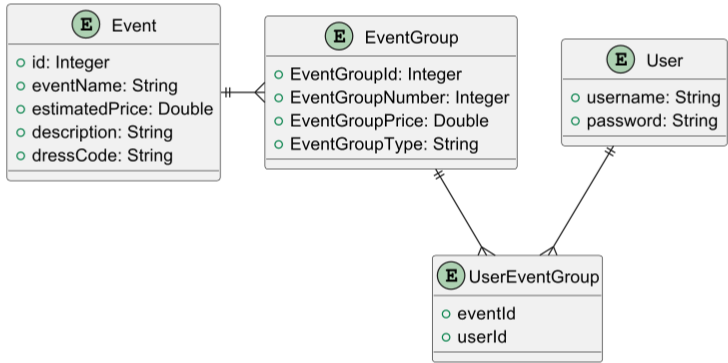
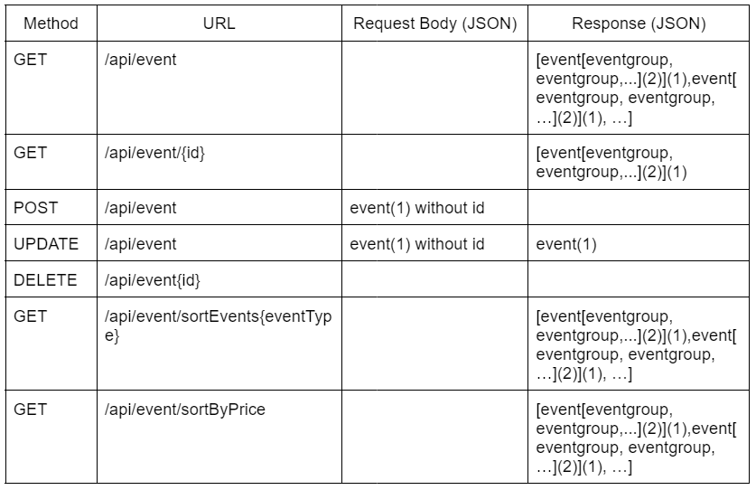

## Experience Swiper

This project aims to bring people together by swiping through different experiences. 
It is implemented using Javalin and JPA

### ER Diagram


Users
- Name
- Address?
- Age
- Phone number
- Email
- ManyToMany EventGroup

### Endpoints


#### (1) Event
```json
{
  "id": Number,
  "eventName": String,
  "estimatedPrice": Number,
  "description": String,
  "dressCode": String ("BUDGET" | "STANDARD" | "LUXURY"),
  "eventGroups": []
}
```

#### (2) EventGroup
```json
{
  "EventGroupId": Number,
  "EventGroupNumber": Number,
  "EventGroupPrice": Number,
  "EventGroupType": String ("Adrenalin" | "Chill" | "Alcohol" | "Educational" | ...),
  "event": {
    "id": Number,
    "eventName": String
  }
}
```

##### (3) User
```json
{
  "username": String,
  "password": String,
  "roles": [
    {
      "roleName": String
    }
  ]
}
```


### How to run

1. Create a database in your local Postgres instance called `event`
2. Run the main method in the config.Populate class to populate the database with some data
3. Run the main method in the Main class to start the server on port 7070
4. See the routes in your browser at `http://localhost:7070/routes`
5. Request the `http://localhost:7070/events` endpoint in your browser to see the list of events and rooms
6. Use the dev.http file to test the routes, GET/POST/PUT/DELETE requests are available

## Docker commands

```bash
docker-compose up -d
docker-compose down
docker logs -f  watchtower
docker logs watchtower
docker logs hotelAPI
docker logs db
docker container ls
docker rmi <image_id>
docker stop <container_id>
docker rm <container_id>
```
